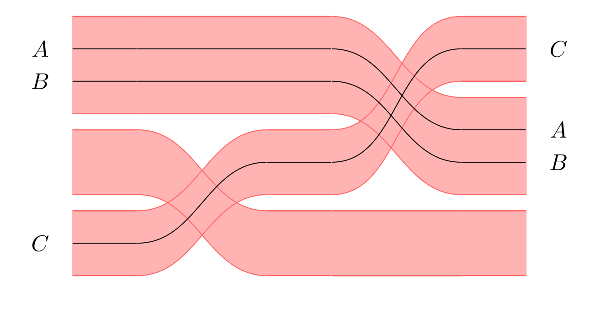

# Tapes

A tool for manipulating and drawing tape diagrams.



## Current features

### Language

The language provided by the tool allows to define, graphically depict and check properties of tape diagrams.

The user can define `tapes` and `terms`, where `tapes` are given by the usual two-layer signature, and `terms` are terms of a sesquistrict rig signature. The following are some examples of definitions:

```
// (sum of id_A and id_B) composed with (the sum-symmetry sigma(A, B))
let t1 : tape = (id(A) + id(B)) ; s+ (A, B).
// circuit generator with signature int * int -> int, embedded within a tape
let t2 : tape = [gen(f, int * int, int)].
// example of complex term
let t3 : term = (split(A*A);((split(A*A) ; ((gen(f, A * A, A) + gen(g, A * A, B * C)) ; (copy(A + (B*C))))) +
    (split(A*A) ; ((gen(f, A * A, A) + gen(g, A * A, B * C)) ;  (copy(A + (B*C))))))) + 
    (( split(A) ; ((gen(f, A, A) ; (id(A) + spawn(A) + spawn(A) + spawn(A))) + id(A)) ) ; ((id(A) + cut(A)) + cut(A) + cut(A) + id(A)) ; join(A)).

```

### Imperative code

The user can define imperative programs, which are compiled down to tapes.

```
let factorial : term = 

BEGIN_IMP [x : int, y : int]
y := x;
while (geq1(y)) {
    y := (dec(x) : int);
    x := (times(x, y) : int)
}
END_IMP.
```

### Tape manipulation

The tools allows to perform simplifications and manipulations on the tape diagrams, such as bringing them to matrix normal form and trace normal form.

### SPASS integration

The tool has the ability to generate SPASS problem files, which allows to automatically check problems such as tape-inclusion and invariant checking.

## Usage

The executable takes as command line argument the path to a text file containing the term. For quick tests, edit the file in `./formula.tapes` and execute `make run`. To visualize the diagrams generated by the program, use the `create_tape.sh` script.